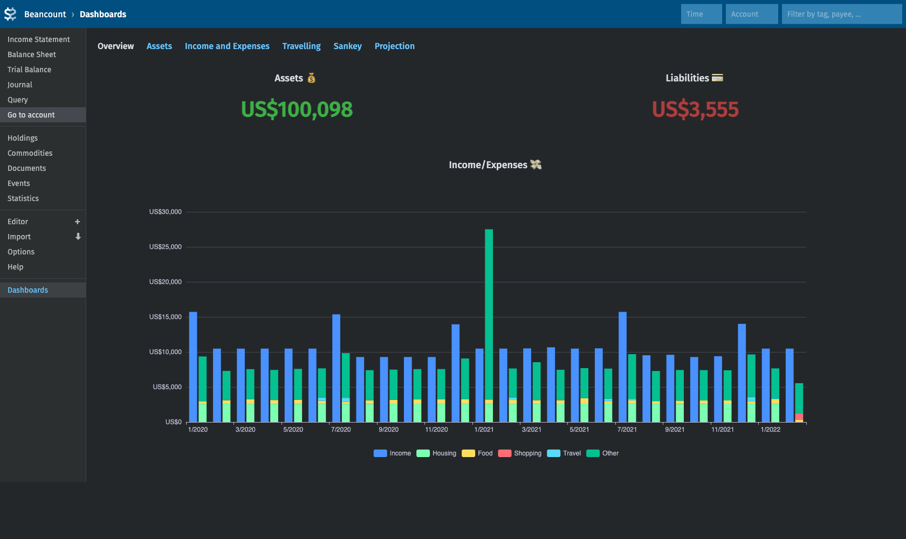
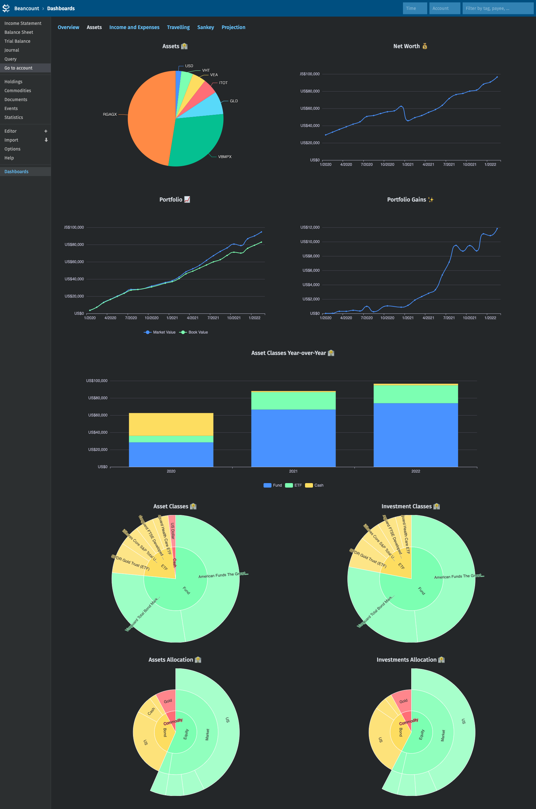
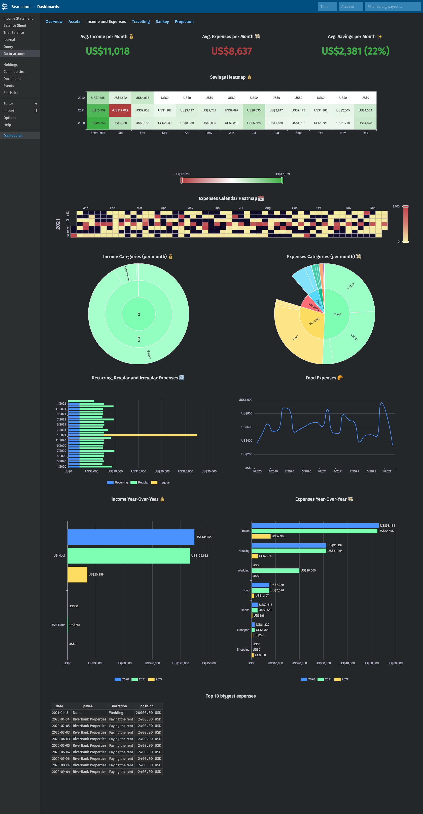
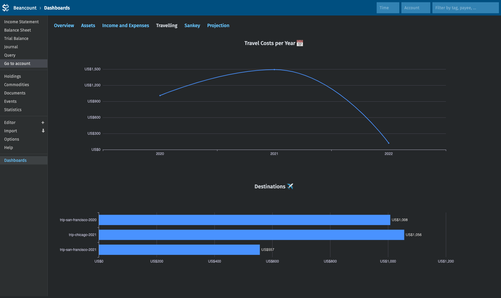
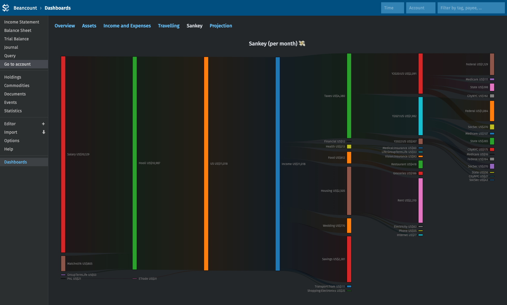
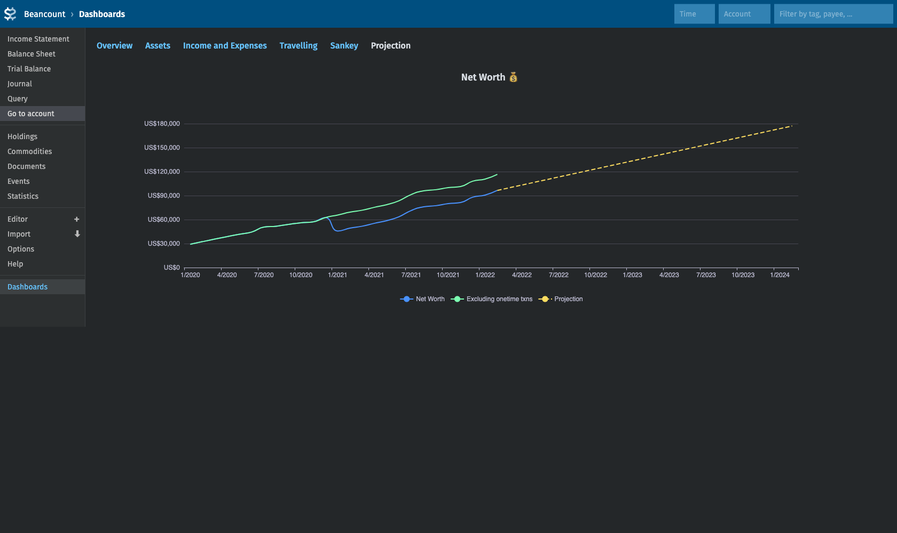

# Fava Dashboards
fava-dashboards allows creating custom dashboards in [Fava](https://github.com/beancount/fava).

Example dashboards with random data:
[](frontend/tests/e2e/__image_snapshots__/dashboard_overview.png)
[](frontend/tests/e2e/__image_snapshots__/dashboard_assets.png)
[](frontend/tests/e2e/__image_snapshots__/dashboard_income_and_expenses.png)
[](frontend/tests/e2e/__image_snapshots__/dashboard_travelling.png)
[](frontend/tests/e2e/__image_snapshots__/dashboard_sankey.png)
[](frontend/tests/e2e/__image_snapshots__/dashboard_projection.png)

## Installation
```
pip install git+https://github.com/andreasgerstmayr/fava-dashboards.git
```

Enable this plugin in Fava by adding the following lines to your ledger:
```
2010-01-01 custom "fava-extension" "fava_dashboards"
```

## Configuration
The plugin looks by default for a `dashboards.yaml` file in the same directory where Fava is started (e.g. if you run `fava personal.beancount`, the `dashboards.yaml` file should be in the same directory as `personal.beancount`).
The location of the `dashboards.yaml` configuration file can be customized:
```
2010-01-01 custom "fava-extension" "fava_dashboards" "{
    'config': '/path/to/dashboards.yaml'
}"
```

Please take a look at the example dashboards configuration [dashboards.yaml](example/dashboards.yaml), which uses most of the functionality described below.

The configuration file can contain multiple dashboards, and a dashboard contains one or more panels.
A panel has a relative width (e.g. `50%` for 2 columns, or `33.3%` for 3 column layouts) and a absolute height.

The `queries` field contains one or multiple queries.
The Beancount query must be stored in the `bql` field of the respective query.
It can contain Jinja template syntax to access the `panel` and `ledger` variables described below (example: use `{{ledger.ccy}}` to access the first configured operating currency).
The query results can be accessed via `panel.queries[i].result`, where `i` is the index of the query in the `queries` field.
Note: Additionally to the Beancount query, Fava's filter bar further filters the available entries of the ledger.

Common code for utility functions can be defined in the dashboards configuration file, either inline in `utils.inline` or in an external file defined in `utils.path`.

**HTML, echarts and d3-sankey panels:**
The `script` field must contain valid JavaScript code.
It must return a valid configuration depending on the panel `type`.
The following variables and functions are available:
* `panel`: the current (augmented) panel definition. The results of the BQL queries can be accessed with `panel.queries[i].result`.
* `ledger.dateFirst`: first date in the current date filter
* `ledger.dateLast`: last date in the current date filter
* `ledger.operatingCurrencies`: configured operating currencies of the ledger
* `ledger.ccy`: shortcut for the first configured operating currency of the ledger
* `ledger.commodities`: declared commodities of the ledger
* `utils`: the return value of the `utils` code of the dashboard configuration

**Jinja2 panels:**
The `template` field must contain valid Jinja2 template code.
The following variables are available:
* `panel`: see above
* `ledger`: see above
* `favaledger`: a reference to the `FavaLedger` object

### Common Panel Properties
* `title`: title of the panel. Default: unset
* `width`: width of the panel. Default: 100%
* `height`: height of the panel. Default: 400px
* `link`: optional link target of the panel header.
* `queries`: a list of dicts with a `bql` attribute.
* `type`: panel type. Must be one of `html`, `echarts`, `d3_sankey` or `jinja2`.

### HTML panel
The `script` code of HTML panels must return valid HTML.
The HTML code will be rendered in the panel.

### ECharts panel
The `script` code of [Apache ECharts](https://echarts.apache.org) panels must return valid [Apache ECharts](https://echarts.apache.org) chart options.
Please take a look at the [ECharts examples](https://echarts.apache.org/examples) to get familiar with the available chart types and options.

### d3-sankey panel
The `script` code of d3-sankey panels must return valid d3-sankey chart options.
Please take a look at the example dashboard configuration [dashboards.yaml](example/dashboards.yaml).

### Jinja2 panel
The `template` field of Jinja2 panels must contain valid Jinja2 template code.
The rendered template will be shown in the panel.

## View Example Ledger
`cd example; fava example.beancount`

## Why no React/Svelte/X?
The main reason is simplicity.
This project is small enough to use plain HTML/CSS/JS and Jinja2 templates only, and doesn't warrant using a modern and ever-changing web development toolchain.
Currently it requires only two external dependencies: pyyaml and echarts.

## Articles
* [Dashboards with Beancount and Fava](https://www.andreasgerstmayr.at/2023/03/12/dashboards-with-beancount-and-fava.html)

## Related Projects
* [Fava Portfolio Returns](https://github.com/andreasgerstmayr/fava-portfolio-returns)
* [Fava Investor](https://github.com/redstreet/fava_investor)
* [Fava Classy Portfolio](https://github.com/seltzered/fava-classy-portfolio)

## Acknowledgements
Thanks to Martin Blais and all contributors of [Beancount](https://github.com/beancount/beancount),
Jakob Schnitzer, Dominik Aumayr and all contributors of [Fava](https://github.com/beancount/fava),
and to all contributors of [Apache ECharts](https://echarts.apache.org), [D3.js](https://d3js.org) and [d3-sankey](https://github.com/d3/d3-sankey).
