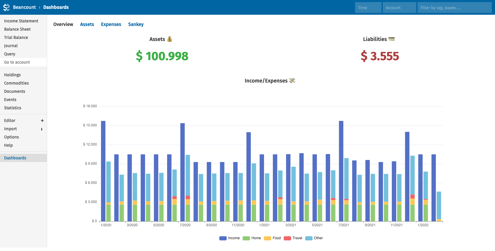
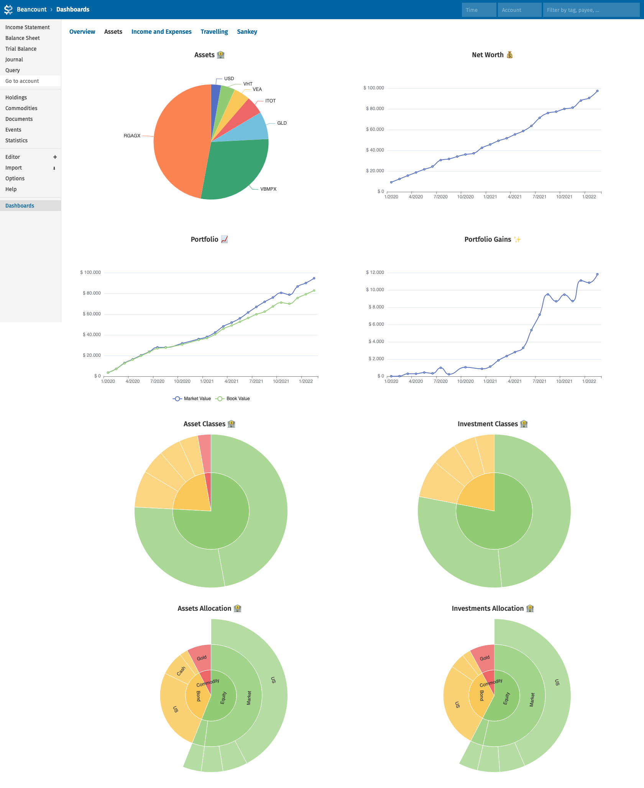
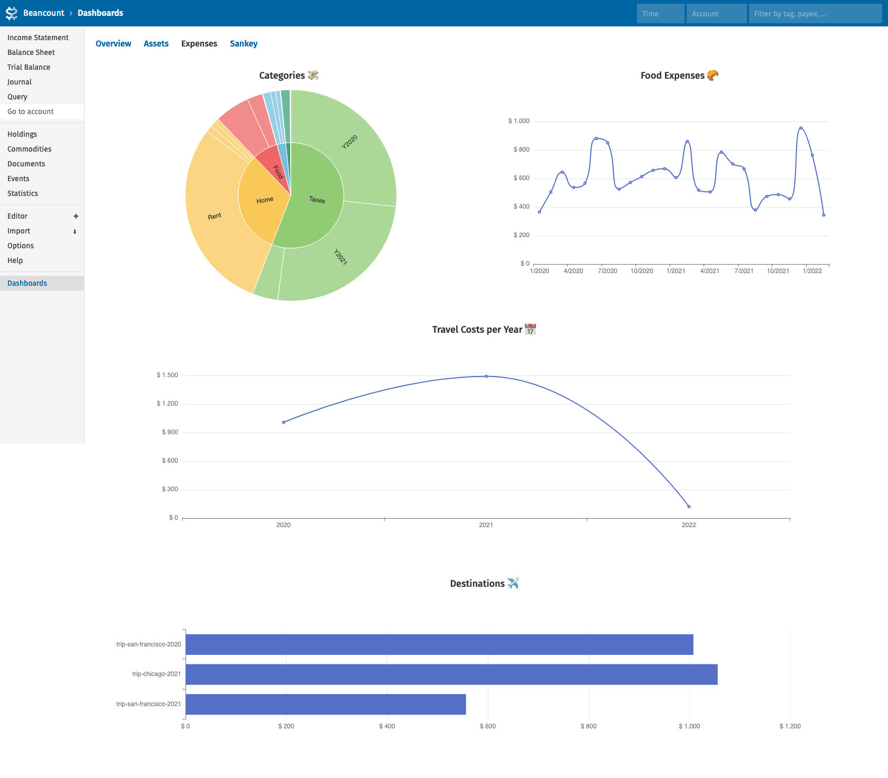
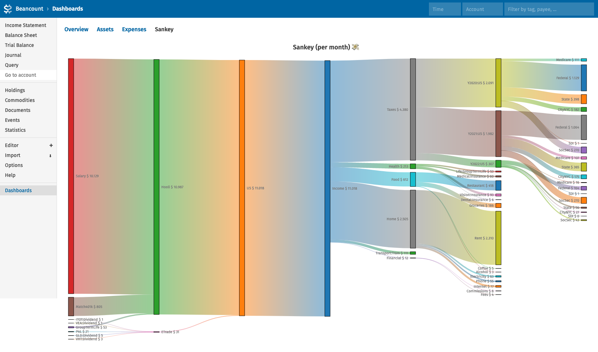

# Fava Dashboards
fava-dashboards allows creating custom dashboards in [Fava](https://github.com/beancount/fava).

[](example/overview.png)
[](example/assets.png)
[](example/expenses.png)
[](example/sankey.png)

## Installation
```
pip install git+https://github.com/andreasgerstmayr/fava-dashboards.git
```

Enable this plugin in Fava by adding the following lines to your ledger:
```
2010-01-01 custom "fava-extension" "fava_dashboards"
```

## Configuration
Please take a look at the example dashboard configuration [dashboards.yaml](example/dashboards.yaml), which uses most of the functionality described below.

The configuration file can contain multiple dashboards, and a dashboard contains one or more panels.
A panel has a relative width (e.g. `50%` for 2 columns, or `33.3%` for 3 column layouts) and a absolute height.

The `queries` field contains one or multiple queries. The beancount query must be stored in the `bql` field of the respectiv query.
The query results can be accessed via `panel.queries[i].result`, where `i` is the index of the query in the `queries` field.
Note: Additionally to the beancount query, Fava's filter bar further filters the available entries of the ledger.

The `script` field must contain valid JavaScript code. It must return a valid configuration depending on the panel `type`.
The following variables and functions are available:
* `panel`: the current (augmented) panel definition. The results of the BQL queries can be accessed with `panel.queries[i].result`.
* `fava.dateFirst`: first date in the current date filter
* `fava.dateLast`: last date in the current date filter
* `helpers.iterateMonths(dateFirst, dateLast)`: iterate over all months between `dateFirst` and `dateLast`, e.g. `[{year: 2022, month: 1}, {year: 2022, month: 2}, ...]`
* `helpers.iterateYears(dateFirst, dateLast)`: iterate over all years between `dateFirst` and `dateLast`, e.g. `[2022, 2023, ...]`
* `helpers.buildAccountTree(rows, valueFn)`: build an account tree based on the results of a BQL query

### Common Panel Properties
* `title`: title of the panel. Default: unset
* `width`: width of the panel. Default: 100%
* `height`: height of the panel. Default: 400px
* `queries`: a list of dicts with a `bql` attribute.
* `type`: panel type. Must be one of `html`, `echarts` or `d3_sankey`.
* `script`: JavaScript code to transform the BQL queries (available in `panel.queries[i].result`) into HTML content, echarts or d3-sankey chart options.

### HTML panel
The `script` code of HTML panels must return valid HTML.
The HTML code will be rendered in the panel.

### ECharts panel
The `script` code of [Apache ECharts](https://echarts.apache.org) panels must return valid [Apache ECharts](https://echarts.apache.org) chart options.
Please take a look at the [ECharts examples](https://echarts.apache.org/examples) to get familiar with the available chart types and options.

### d3-sankey panel
The `script` code of d3-sankey panels must return valid d3-sankey chart options.
Please take a look at the example dashboard configuration [dashboards.yaml](example/dashboards.yaml).

## View Example Ledger
`cd example; fava example.beancount`

## Why no React/Svelte/X?
The main reason is simplicity.
This project is small enough to use plain HTML/CSS/JS and Jinja2 templates only, and doesn't warrant using a modern and ever-changing web development toolchain.
Currently it requires only two external dependencies: pyyaml and echarts.

## Related Projects
* [Fava Portfolio Returns](https://github.com/andreasgerstmayr/fava-portfolio-returns)

## Acknowledgements
Thanks to Martin Blais and all contributors of [beancount](https://github.com/beancount/beancount),
Jakob Schnitzer, Dominik Aumayr and all contributors of [Fava](https://github.com/beancount/fava),
and to all contributors of [Apache ECharts](https://echarts.apache.org), [D3.js](https://d3js.org) and [d3-sankey](https://github.com/d3/d3-sankey).
